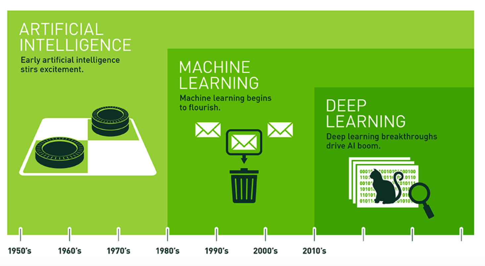
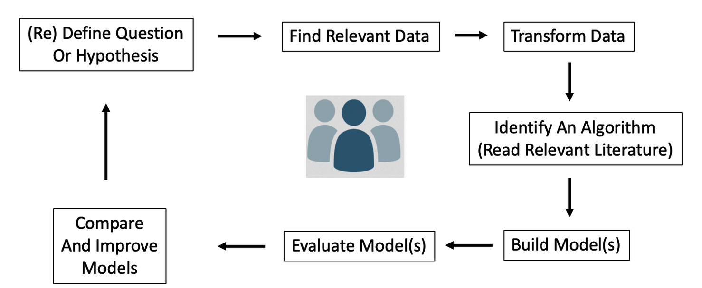
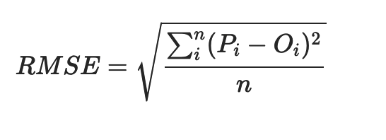
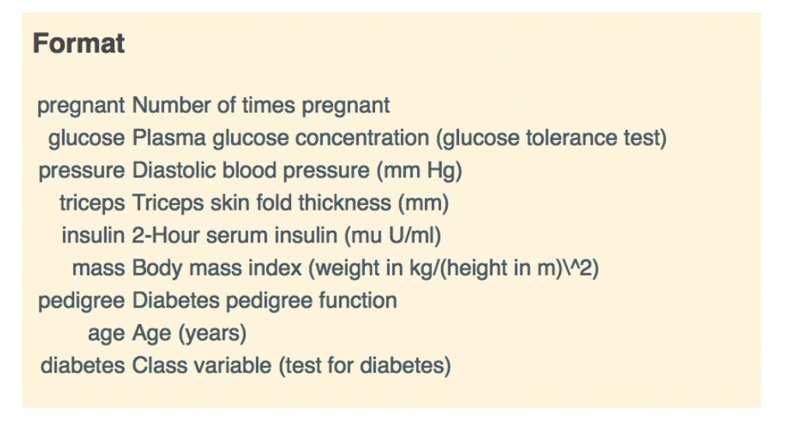
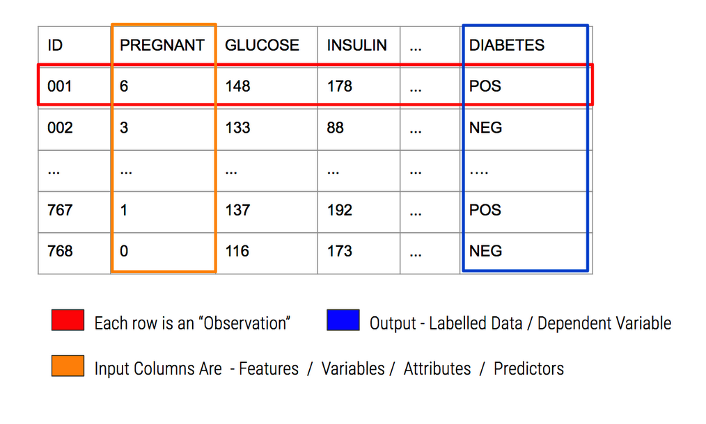
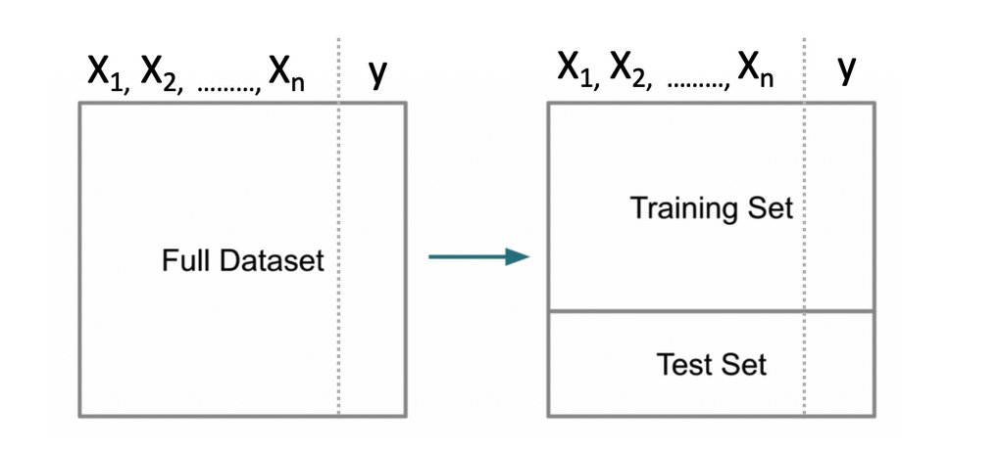
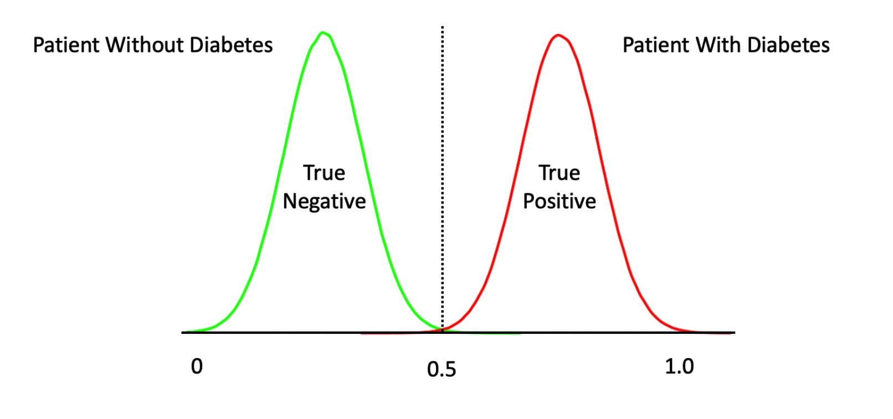
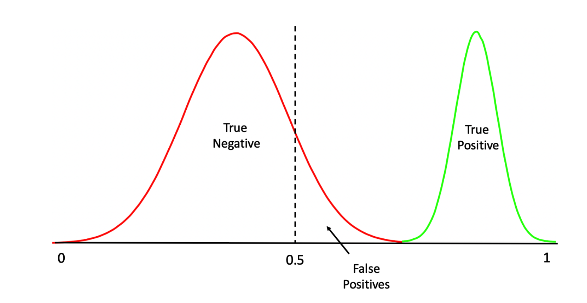
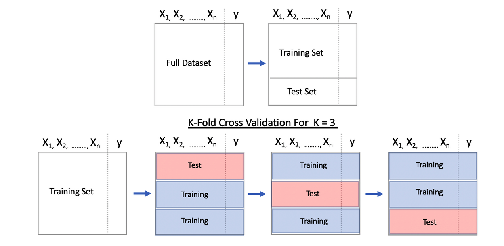

```{r echo=FALSE}
suppressMessages(library(tidymodels))
```


Note you may use this in your work as long as it's not part of a commerical project. Any use should cite this notebook and author accordingly. 

```{r eval=FALSE}
https://cimentadaj.github.io/blog/2020-02-06-the-simplest-tidy-machine-learning-workflow/the-simplest-tidy-machine-learning-workflow/
```

# Introduction

This notebook motivates the use of the tidy models as a way to simplify the processes associated with building models and evaluating them. While it is entirely possible to use Base R methods to organize data and build models thereon, the tidyverse and tidymodels provide a uniform interface for interacting with data and model assembly. 


What I hope you get out of this includes the following:

1) An idea of what is involved into basic ML and building models
2) You can use Base R to do modeling and it's fine
3) But the tidyverse offers a well thought out philosophy for managing data
4) The tidymodels package builds on top of the tidyverse to carry the philosophy into ML

## Predictive Modeling 

Predictive Modeling is a type of Machine Learning which itself is a sub branch of Artificial Intelligence. The following graphic provides us with some history of these domains. This is helpful if you are trying to orient yourself in the world of analytics and machine learning. Note that AI has been around for quite some time. The Wikipedia definition of AI is:

    The study of “intelligent agents”: any device that perceives its environment and takes actions that maximize its chance of successfully achieving its goals
    
I found the following image on Intel web page but can't remember where but I didn't generate it. Someone at Intel did. 
    
    

Machine Learning relies upon “patterns and inference” to “perform a specific task without using explicit instructions”. It is a form of Applied AI that attempts to automatically learn from experience without being explicitly programmed. Think of Predictive Modeling as a subset of this which falls into two categories:

**Supervised**

Algorithms that build a model on a set of data containing both the inputs and the desired outputs (“labels” or known numeric values). When you want to map input to known output labels. Build a model that, when applied to “new” data, will hopefully predict the correct label.

**Unsupervised**

Algorithms that take a set of data that contains only inputs, and find structure in the data (e.g. clustering of data points).

This lecture is concerned primarily with Predictive Modeling. Some examples of Predictive Modeling include:

    Predict current CD4 cell count of an HIV-positive patient using genome sequences

    Predict Success of Grant Applications

    Use attributes of chemical compounds to predict likelihood of hepatic injury

    How many copies of a new book will sell ?

    Will a customer change Internet Service Providers ?

A typical workflow in support of predictive modeling might look this:



Also see 

https://raw.githubusercontent.com/dataprofessor/infographic/master/01-Building-the-Machine-Learning-Model.JPG

**In-Sample vs Out-Of-Sample Error**

The goal of predictive model is to generate models that can generalize to new data. It would be good if any model we generate could provide a good estimate of out of sample error. It’s easy to generate a model on an entire data set (in sample data) and then turn around and use that data for prediction. But how will it perform on new data ? Haven’t we just over trained our model ?

**Performance Metrics**

For either case (regression vs classification) we need some type of metric or measure to let us know how well a given model will work on new or unseen data - also known as “out of sample” data. for Classification problems we look at things like “sensitivity”, “specificity”, “accuracy”, and “Area Under Curve”.

For Quantitative outcomes, we look at things like Root Mean Square Error (RMSE) or Mean Absolute Error (MAE). Here is the formula for Root Mean Square Error (RMSE). P represents a vector of predictions and O represents a vector of the observed (true) values.




## The "Old Way" - Using Base R and addons

While 'old" sounds somewhat negative, there is absolutely nothing wrong using an established approach to model data using Base R. This involves applying specific packages to build, for example, a logistic regression model, a decision tree, or a support vector machine. 

The job involves identifying the appropriate package(s) and then dividing the data up in to training and testing pairs after which a function name is called to do the work. 

At a minimum, one must specify 1) the training data set and 2) a formula which indicates what the target and predictor variables will be. Then you look at the result

1) Identify appropriate packages(s) - glm, RandomForest, ranger, svm, etc
2) Chop up the data into a training and test pair (possibly use cross fold validation)
3) Use the right function name and pass arguments - data and prediction formula
4) Examine result using a pre-defined performance diagnostic (e.g. RMSE, Accuracy, Sensitivity, AUC)

### An Example

Let's run through an example using the infamous **Pima Indians** dataset to predict whether a car has an automatic transmission (0) or a manual transmission (1). First, let's chop up the data into a training and test pair. To get the ball rolling with a practical case, let’s consider the Pima Indians Data Frame. Read in a copy.

```{r}
url <- "https://raw.githubusercontent.com/steviep42/bios534_spring_2020/master/data/pima.csv"
pm <- read.csv(url)

head(pm)
```


The description of the data set is as follows:



In predictive modeling we have some important terminology:




```{r}
corrplot::corrplot(cor(pm[,-9]))
```


Look at some differences between the positive vs negative cases:

```{r}
myt <- table(pm$diabetes)
barplot(myt,
        ylim=c(0,600),
        main="Pima Indians - Count of Cases",
        names.arg=names(myt),
        ylab="Case Count",
        xlab="Cases")
grid()
```


```{r}
boxplot(glucose~diabetes,
        data=pm,
        horizontal = TRUE,
        col="aquamarine",
        main="Distribution of Glucose per Group")
grid()
```

So let's plot Glucose vs Mass to see if any interesting hypotheses come to mind (or not):


```{r}
# Split the data on the target variable which is diabetes
mysplits <- split(pm,pm$diabetes)

# Create a plot window with appropriate dimensions
plot(pm$mass,pm$glucose,type="n",
     main="Glucose To Mass Relationship",
     xlab="Mass",
     ylab="Glucose",
     sub="Data from Pima Indians Data")

# Now put up the mass vs glucose for each group (pos and neg)
cols <- c("green","red")
for (ii in 1:length(mysplits)) {
   points(mysplits[[ii]]$mass,
          mysplits[[ii]]$glucose,
          col=cols[ii],pch=18)  
}
# Draw a grid
grid()

# Put up a legend
legend("topright",
       legend=names(mysplits),
       pch=18,
       col=cols,title="Group")
```

## Splitting Data For Model Building

At this point we want to build a model to predict whether a given observation will be positive for diabetes (or negative). 

What we will do is create a training and testing data set using the **sample** function. Here we will carve out rouhgly 80% of the data for training and 20% for testing. 




```{r}
set.seed(123)  # Makes this example reproducible
nrows <- nrow(pm)
propo <- 0.70
(idx <- sample(1:nrows,propo*nrows))
```
Now, we create the train/test pair:

```{r}
pm$diabetes <- factor(pm$diabetes)
pm_training <- pm[idx,]
pm_testing  <- pm[-idx,]

print(paste("Training data has",nrow(pm_training),"rows"))
print(paste("Testing data has",nrow(pm_testing),"rows"))
```

## A First Model

Let's build a model using the Generalized Linear Models function. Note that there are other types of functions we could use but most people have at least heard of Logistic Regression so let's start with that as it also provides us the opporunity to understand some basic ML concepts. 

The **glm** function is part of Base R so you don't need to load any additional packages to use it. We need to specify a formula, some training data, and a "family" argument. 

```{r}
myglm <- glm(diabetes ~ .,
             data = pm_training,
             family = "binomial")

summary(myglm)
```

It's helpful to know what this object contains. Many people do not bother to look but there is a lot of information contained therein:

```{r}
str(myglm)
```

For now just observe that some of the features (e.g. age, insulin, triceps) do not appear to be important or significant though we'll ignore that for now - just like a lot of professional machine learning specialists do everyday (to their own peril). 

We could do some "feature filtering" or "engineering" to first transform or remove features to make the model diagnostics better but that's outside of the scope of this lecture.

Let's pretend that all is well and now use this new model to predict outcomes using the test data set. Remember that we are attempting to predict a binary outcome - in this case whether the person is positive for diabetes or negative. 

What we get back from the prediction object are probabilities for which we have to determine a threshold above which we would say the observation is “positive” for diabetes and, below the threshold, “negative”.

```{r}
probs <- predict(myglm,
                 newdata = pm_testing,
                 type = "response")

probs[1:10]
```

With logistic regression we are dealing with a curve like the one below which is a sigmoid function. The idea is to take our probabilities, which range between 0 and 1, and then pick a threshold (aka "alpha") over which we would classify that observation / person as being positive for diabetes. 

```{r}
myseq <- seq(-6,6,.1)
myfunc <- function(x) {1/(1+exp(-x))}
plot(myseq,myfunc(myseq),
     type = "l",
     main = "Standard Logistic Sigmoid Function",
     ylab = "")
abline(h=0.5,lty=2)
abline(v=0,lty=2)
text(-0.5,0.55,"0.5")
grid()
```

### Selecting The Correct Alpha

The temptation is to select 0.5 as the threshold such that if a returned probability exceeds 0.5 then we classify the associated subject as being “positive” for the disease. But then this assumes that the probabilities are distributed accordingly. This is frequently not the case though it doesn’t stop people from using 0.5. Another way to view this is as follows. This graphic shows a “perfect” classifier which more or less matches the logit function above:




Note that this is a rare situation wherein there exists a clean separation between negative and positive cases. We could more lukely have something like this:




One thing we should do here is to look at the distribution of the returned probabilities before making a decision about where to set the threshold. We can see clearly that selecting 0.5 in this case would not be appropriate.

```{r}
boxplot(probs, 
        main="Probabilities from our GLM Model")
grid()
```

The median appears to be somewhere around .25 so we could use that for now although we are just guessing.

```{r}
mypreds <- ifelse(probs > 0.25,"pos","neg")
mypreds <- factor(mypreds, levels = levels(pm_testing[["diabetes"]]))
mypreds[1:10]
```

### Confusion Matrices

Next, we would compare our predictions against the known outcomes which are stored in the test data frame:

```{r}
# How does this compare to the truth ?
table(predicted = mypreds,
      actual = pm_testing$diabetes)
```

What we are doing is building a "Confusion Matrix" which can help us determine how effective our model is. From such a matrix table we can compute a number of “performance measures”, such as accuracy, precision, sensitivity, specificity and others, to help assess the quality of the model. In predictive modeling we are always interested in how well any given model will perform on “new” data.

There are some functions that can help us compute a confusion matrix. Because the variable we are trying to predict, (diabetes), is a two level factor, (“neg” or “pos”) we’ll need to turn our predictions into a comparable factor. Right now, it’s just a character string.

```{r}
caret::confusionMatrix(mypreds,pm_testing$diabetes)
fourfoldplot(caret::confusionMatrix(mypreds,pm_testing$diabetes)$table)
```

```{r}
newpreds <- ifelse(probs > 0.55,"pos","neg")
newpreds <- factor(newpreds, levels = levels(pm_testing[["diabetes"]]))
newpreds[1:10]

table(predicted = newpreds,
      actual = pm_testing$diabetes)

caret::confusionMatrix(newpreds,pm_testing$diabetes)
fourfoldplot(caret::confusionMatrix(newpreds,pm_testing$diabetes)$table)
```


### Performance Measures Revisited

This is helpful stuff although there are a number of measures to select as a primary performance metric. Ideally, we would already know which performance metric we would select to effectively “judge” the quality of our model. 

In medical tests, "sensitivity" and "specificity" are commonly used. Some applications use “Accuracy” (which isn’t good when there is large group imbalance).

The problem here is that all we have done is looked at the confusion matrix corresponding to one specific (and arbitrary) threshold value when what we need is to look at a number of confusion matrices corresponding to many different thresholds. 

For example, we might get a better sensitivity level had we selected the mean of the returned probabilities. This process could go on and on and on.

### The ROC Curve

One way to do this is to use something known as the ROC curve. Luckily, R has functions to do this. This isn’t surprising as it is a standard tool that has been in use for decades long before the hype of AI and ML was around. The ROC curve gives us a “one stop shop” for estimating a good value of alpha.

We want to maximize the area under a given ROC curve as it winds up being an effective way to judge the differences between one method and another. So, if we wanted to compare the glm model against a Random Forest model, we could use the respective AUC (Area Under Curve) metric to help us. This isn’t the only way to do this but it’s reasonable for now.

Compute the TPR and FPR for a lot of different alpha values. This is what the ROC curve is all about:

```{r}
pred <- ROCR::prediction(predictions = probs,
                         labels = pm_testing$diabetes)

perf <- ROCR::performance(pred,
                    "tpr",
                    "fpr")

myroc <- ROCR::performance(pred,measure="auc")

plot(perf,colorize=T,
        print.cutoffs.at=seq(0,1,by=0.1),
     lwd=3,las=1,main=paste("Cool GLM ROC Curve with",round(myroc@y.values[[1]],3),"AUC"))
abline(a = 0, b = 1)

grid()
```

So what value of alpha corresponds to the statedAUC of .85 ? We’ll have to dig into the performance object to get that but it looks to be between 0.30 and 0.40. Note that this is somewhat academic since knowing the max AUC alone helps us decide if our model is any “good”. For completeness we could use another R function to nail this down:

```{r}
proc <- pROC::roc(pm_testing$diabetes,probs)
round(pROC::coords(proc, "b", ret="t", transpose = FALSE),2)
```

Before we leave this example we could have also used the ROCR::performance function to help us answer this question (See https://www.thetopsites.net/article/50636333.shtml)

```{r}
plot(unlist(performance(pred, "sens")@x.values), 
     unlist(performance(pred, "sens")@y.values), 
     type="l", lwd=2, ylab="Sensitivity", xlab="Cutoff",
     main="Optimal Cutoff To Balance Sens and Spec")

par(new=TRUE)

plot(unlist(performance(pred, "spec")@x.values), 
     unlist(performance(pred, "spec")@y.values), 
     type="l", lwd=2, col='red', ylab="", xlab="")
axis(4, at=seq(0,1,0.2),labels=as.character(seq(0,1,0.2)))
mtext("Specificity",side=4, padj=-2, col='red')
grid()
```


We haven’t accomplished very much here because we need to look at multiple versions of the data in case we sampled a number of outliers in the creation of our training data. Or, maybe we have excluded a large number of outliers in the training set so they wound up in the test data set which means that the predictive power of our model isn’t as robust as it should be.

Our next steps should involve creating multiple versions of the training and test pairs (say 3 times), compute the optimal AUC, and then look at how those values vary for each of those individual versions. If the AUCs vary widely then maybe our model is over training. If it’s not varying widely, it could be that that the model has high bias.

## What Did We Do?

1) So we chopped up some data into training and testing info
2) Built a model on the training data using logistic regression
3) Made a prediction on the test data using some arbitrary alpha value
4) Created a comparison between known reality and our predictions (confusion matrix)
5) We experimented with a couple of different alphas
6) Observed that creating a ROC curve gave us a good way to select an alpha
7) ROC curves can help us decide between one model or another. 

## Cross Fold Validation

What if, when splitting the data into a training and testing pair, the test set wound up containing most of the outliers in the data (assuming there were any). This means that our trained model would probably under perform on the test data since the model did not "see" most of the outliers. 

Or, consider the situation wherein the training data had most of the outliers and the resulting model was influenced by this. So, when applied to the testing data, the predictive results are not that great. 

A way to combat this is to split the data into K number of groups aka "folds" - say 3. Then set up a loop that uses K-1 folds to train a model while using the "hold out" fold as the test data set. This means that each fold is used as a test set once.

It also means that each fold also gets used as part of a trained model thus we can offset the impact of any outliers found in the data set. Note, we are not trying to perfectly model the data, we just want to get a realistic idea as to how it might perform on unseen data. 

The method works by giving us multiple estimates of out-of-sample error, rather than a single estimate. Let's assume K is equal to 3 so we will partition our data into 3 individual “folds”" which are basically equal in size. Then we’ll create a loop that does the following:

    Combines 2 of the folds into a training data set
    Builds a model on the combined 2-folds data
    Applies the model to holdout fold
    Computes the AUC value and stores it

Each fold is simply a portion of the data. We’ll generate a list called “folds” that contains 3 elements each of which are 256 index elements corresponding to rows in pm. The way we did the sample insures that each row shows up only in one fold.

{width=120%}

We could write our own function to not only create some number of folds but to also build a model, make predictions and store the accuracy for a given set of folds. Remember, each fold gets to be a "test" data set as part of the process.

```{r}
cross_fold <- function(numofolds = 4,df=pm) {
  
  # Function to Do Cross fold validation
  
  # Split the data into K folds (numofolds)
  
  folds <- split(sample(1:nrow(df)),1:numofolds) 
  
  # We setup some blank lists to stash results
  folddf    <- list()  # Contains folds
  modl      <- list()  # Hold each of the K models
  predl     <- list()  # Hold rach of the K predictions
  auc       <- list()  # Hold the auc for a given model
  
  # Create a formula that can be used across multiple
  # iterations through the loop. 
  
  myform <- "diabetes ~ ."
  
  for (ii in 1:length(folds)) {
    
    # This list holds the actual model we create for each of the 
    # 10 folds
    
    modl[[ii]] <- glm(formula = myform, 
                      data = df[-folds[[ii]],],
                      family = "binomial")

    
    # This list will contain / hold the models build on the fold
    
    predl[[ii]]  <- predict(modl[[ii]],
                            newdata=df[folds[[ii]],],
                            type="response")
   
    # This list will hold the results of the AUC per iteration
    
    pred <- ROCR::prediction(predl[[ii]],
                             df[folds[[ii]],]$diabetes)
    
    roc  <- ROCR::performance(pred,measure="auc")
    auc[[ii]] <- roc@y.values[[1]]
  }
  return(unlist(auc))
}
```

Running this is now quite simple. By default, this function will loop some number of times corresponding to the number of folds. During each iteration it will:

    use glm to build a model on the training folds
    create a prediction object using the training fold
    compute the underlying AUC associated with the prediction
    store the AUC in a vector

At the end of the function, the vector containing the computed AUCs will be returned.

An advantage of this approach is that we can now look at a range of accuracy values (K of them) instead of just one. This gives us a better idea about how the model might perform on future data. Here we will look at accuracy across 8 folds:


```{r}
numofolds <- 8
boxplot(cross_fold(numofolds = numofolds),
        main=paste("Distribution of Accuracy for",numofolds,"folds"),
        horizontal = TRUE)
grid()
```

We can even replicate this to approximate something known as repeated cross validation:

```{r}
numofolds <- 8
numofrepl <- 20

main <- paste("Accuracy Across",numofolds,"folds","\n and",numofrepl,"replications")
reps <- replicate(numofrepl,cross_fold())

boxplot(reps,
        main=main,cex.axis=.8,
        xlab="Simulation Number",
        ylim=c(min(reps)-0.025,max(reps)+0.025),
        ylab="Accuracy")
grid()
```

## Summary 

So what have we done here. Well let's recap:

1) Select some data and a method
2) Split the Data into training and testing data sets 
3) Build a model on it and make some predictions on the test
4) Evaluate the model on the basis of a selected performance measure (e.g. accuracy, sensitivity, AUC)
5) Look at plots such as ROC

Then we might extend this by doing K-Fold cross validation at Step 2 to get a better idea as to how the model
we built might apply to the test data. If we wanted to use another method, say random forests, we could but that would require us to understand the calling sequence for that method.

## A Different Approach

We could do all of the above in a more general manner by using something called **tidymodels**. There is also a package called **caret** which does similar things using base R. But since the author of **caret**, Max Kuhn, has now joined the **tidymodels** team it seems that **caret** is in maintenance mode only. In any case, to understand **tidymodels** one must first understand the **tidyverse**.

The **tidyverse** represents an extension on top of the base functions found in the default installation of R. Using **tidy** commands is an entirely optional activity and there is no need to use them except in pursuit of the concepts the tidyverse seeks to implement.

That sounds like circular logic but the idea is to pursue an approach that generalizes across multiple steps in data manipulation and modeling. Being able to easily reuse R objects (data, results, figures) is a big deal because it simplifies the construction and comparison of models which in turn facilitates reproducibility.

One would also like to be able to transfer knowledge acquired in using one package to other packages in the R environment. That said, in my view (and it's only that), having a good knowledge of base R is important since you are likely to encounter "legacy" code which does not use things like the **tidyverse** or **tidymodels**.

Some introductory courses dive straight into the **tidyverse** and that is fine to an extent. It's just that if you enter a work environment that has lots of older R code you will need to work to understand it. As this presentation assumes previous experience with R we will not be going over R basics.

## The tidyverse

The **tidymodels** package comprises a number of supporting packages and installing it is as simple as doing:

```{r install,eval=FALSE}
install.packages("tidymodels")
```

The **tidymodels** package relies on the **tidyverse** package which provides verbs that correspond to common data manipulation activities. The **tidyverse** package also provides the **ggplot2** package which is a premier visualization tool. Back to the verbs. Here are some basic examples using the **mtcars** data frame which is frequently used in R education due its simplicity and small size.

Let's filter the data based on values assumed by one or more columns.

```{r select1}
filter(pm, pregnant > 10 & age < 40)
```

```{r}
# Get all rows where diabetes is "pos" and mass is < 20
filter(pm, diabetes == "pos" & mass < 20)
```

We can even do aggregation using tidyverse functions. What is the average glucose per diabetes group?

```{r}
summarize(group_by(pm,diabetes),avg=mean(glucose))
```

### Piping 

One of the coolest functions provided by tidyverse is the pipe operator which allows us to feed the output of one command to the input of another in a left-to-right fashion. This concept is now new and was originally developed for use in the UNIX / LINUX operating system. 

Base R uses composite functions in accordance of its heritage as a mathematical / statistical language. So structures like f(g(x)) or f(g(h(x))) are easily accommodated but prone to errors in typing due to the need to match parentheses. 


```{r}
# The composite function approach so Favored by mathematicians 
x <- 3.14
log(cos(sin(tan(x))),base=10)
```

Using the pipe structure this would look like the following which allows you to build the line a command at a time which makes it less error prone. You "read" the command from left to right where the output of one command becomes the input to another and so on. 

```{r}
x %>% tan() %>% sin() %>% cos() %>% log(base=10)

# or even

3.14 %>% tan() %>% sin() %>% cos() %>% log(base=10)
```


```{r}
# The pipe operator is %>%
pm  %>% filter(diabetes == "pos" & mass < 20)
```

We can conveniently sort data. In this case we filter out cars with MPG greater than 15 and a weight less than 2 tons and then arrange the result in order of highest MPG to lowest.

```{r}
pm %>% 
  filter(diabetes == "pos" & mass < 25) %>% 
  arrange(desc(glucose))
```

As applied to our above grouping example we could de-couple the somewhat verbose Base R command line:

```{r}
pm %>% group_by(diabetes) %>% summarize(average_glucose=mean(glucose))
```

Note that the "%>%" operator allows us to **route** the output of a command to the input of another command. Here is a more simple example:

```{r}
pm %>% filter(mass > 50)
# same as
filter(pm, mass > 50)
```

Back to our aggregation pipeline, we can "pipe" the result into the ggplot function to get a visualization. ggplot requires us to provide it tables or data frames. Actually it prefers "tibbles" which is a type of data frame but that's getting off track a little bit.

```{r}
pm %>% 
  group_by(diabetes) %>% 
  summarize(average_glucose=mean(glucose)) %>%
  ggplot(aes(x=diabetes,y=average_glucose)) + 
    geom_bar(stat="identity")  + 
    ggtitle("Avg Glucose / Group")
```

If we wanted to improve upon this we could, perhaps by making the transmission type into a factor with more intuitive labels. Here we will introduce another **tidyverse** function to **mutate** the **am** variable into a factor.

```{r}
pm %>% 
  group_by(diabetes) %>% 
  summarize(average_glucose=mean(glucose)) %>%
  ggplot(aes(x=diabetes,y=average_glucose)) + 
    geom_bar(stat="identity")  + 
    theme_light() + 
    labs(title = "Average Glucose / Group", 
         subtitle = "Data extracted from Pima Indians Data set", 
         caption = "Super Cool tidyverse example")
```

A distinct advantage of this approach is that we did not change in anyway the original data frame. Check it out:

```{r}
head(pm)
```

The piping allows for free-form experimentation without the need for having to save temporary and/pr incremental versions of data frames which is frequently the case when using Base R commands. Here is another example:

```{r}
pm %>%
  ggplot(aes(x=mass,y=glucose,color=diabetes)) + 
  geom_point(alpha=0.5) +
  labs(
    title = "Glucose Level vs Mass",
    caption = "Data from the Pima Indians Data set.",
    tag = "Figure 1",
    x = "Mass in kg(height in m)^2",
    y = "Plasma glucose concentration",
    colour = "diabetes"
  ) + theme_bw() + scale_color_brewer(palette="Dark2")
```


### Broom - sweeping things up

The tidyverse has a way to help clean up the results offered by Base R packages. Consider the following:

```{r}
fit <- lm(glucose ~ mass + age,pm_training)
```

Look at the output which is not directly in a convenient format.

```{r}
fit
```
```{r}
summary(fit)
```

Access coefficients only:

```{r}
fit$coefficients
```

But with a tidy approach you get things in a data frame which is inarguably the most flexible data type in the R language. The tidy function "produces a tibble() where each row contains information about an important component of the model. For regression models, this often corresponds to regression coefficients"

```{r}
tidy(fit)
```


The glance function "returns a tibble with exactly one row of goodness of fitness measures and related statistics. This is useful to check for model misspecification and to compare many models"

```{r}
glance(fit)
```

The **augment** function "adds columns to a dataset, containing information such as fitted values, residuals or cluster assignments. All columns added to a dataset have . prefix to prevent existing columns from being overwritten."

```{r}
augment(fit, pm_training)[1:10,]
```

```{r}
augment(fit, pm_training) %>% 
  ggplot(aes(x=glucose,y=.fitted,color=diabetes)) + 
  geom_point() + labs(title="Fitted vs Glucose") + theme_bw()
```


## Tidymodels

The **tidymodels** package can be useful even if you are just experimenting since it provides a standard and uniform approach by which to work. In Base R, each modelling function, lm, glm, rpart, svm, will all have arguments specific to the respective command, which contributes to confusion when switching between models for purposes of comparison. This is where **tidymodels** can be very helpful.

One of the benefits of the package is that it provides front ends for the many methods available in R which includes Decision trees and extensions there upon. An advantage of Base R when building models is that many methods will convert the target variable to a label / nominal feature without you asking it to. This is a convenience though the tidyverse generally wants you do be explicit about this. 

```{r}
url <- "https://raw.githubusercontent.com/steviep42/bios534_spring_2020/master/data/pima.csv"
pm <- read.csv(url)

pm <- pm %>% mutate(diabetes=factor(diabetes))
skimr::skim(pm)
``` 


### A First tidymodel

We'll repeat our **glm** example though this time using tidymodels. It is important to understand that the **tidymodels** package does not attempt to replace or rewrite common and popular R packages for model assembly. 

The package provides an standard and uniform interface that "sits on top" of various package functions. The advantage to the user is that you do not necessarily need to know all of the individual arguments to a specific command in order to use it though if you do then you can still leverage that information.


```{r}
pm_tidy_glm <- logistic_reg(mode = "classification") %>%
  set_engine("glm") 
```

```{r}
pm_tidy_glm
```

Tp get more info:

```{r}
pm_tidy_glm %>% translate()
```


```{r}
pm_tidy_glm_fit <- logistic_reg(mode = "classification") %>%
  set_engine("glm") %>%
  fit(diabetes ~ ., data = pm_training)
```


What do we get back?

```{r}
pm_tidy_glm_fit
```

In terms of making a prediction, we can do that easily. The **predict** function is what we call a generic function in R which understands how to do its work based on the type of object and data that it is being given. Remember that we built a model which returned an object. We can pass that to the **predict** function:

```{r}
glance(pm_tidy_glm_fit)
```


```{r}
# Use the ranger model to make a prediction
test_preds <- predict(pm_tidy_glm_fit,pm_testing,type="class")
test_preds[1:10,]
```

Note that we also have access to probabilities which could be useful if we needed to generate a ROC curve or wanted to take finer grained control over thresholds.

```{r}
predict(pm_tidy_glm_fit,
        pm_testing,type="prob")[1:10,]
```


By default we get back some predictions as to whether a subject is positive or negative for diabetes which we could then compare to the actual values. This would allow us to create a confusion matrix that would then permit the computation of various performance measures such as accuracy, sensitivity, specificity, etc.

In the tidymodels world, there are functions that will give this information to us without the need for the confusion matrix unless we wanted to print it. 

The following shows us the predictions as part of the data frame. The tidyverse very much likes for things to be in a data frame format - actually something called a **tibble** which is a data frame optimized for use with the tidyverse.

```{r}
pm_tidy_glm_fit %>%
  predict(pm_testing) %>%
  bind_cols(pm_testing) %>%
  glimpse()
```

This sets the stage for evaluating the accuracy of the predictions resulting from the model:

```{r}
my_metrics <- metric_set(accuracy,sensitivity,specificity, precision)
pm_tidy_glm_fit %>%
  predict(pm_testing) %>%
  bind_cols(pm_testing) %>%
  my_metrics(truth=diabetes, estimate=.pred_class,event_level = "second")
```

So we could derive all the metrics directly from the confusion matrix - if we wanted to

```{r}
pm_tidy_glm_fit %>%
  predict(pm_testing) %>%
  bind_cols(pm_testing) %>%
  conf_mat(truth=diabetes, estimate=.pred_class)
```


But we don't need to do this as tidymodels has its own way of getting multiple metrics all at once or a subset thereof:

```{r}
pm_tidy_glm_fit %>%
  predict(pm_testing) %>%
  bind_cols(pm_testing) %>%
  conf_mat(truth=diabetes, estimate=.pred_class) %>% 
  summary(event_level="second")
```
Or you can specify just the ones you want without having to even generate the confusion matrix

```{r}
# Note that sensitivity is also known as recall
my_metrics <- metric_set(accuracy, sensitivity, specificity, precision)
pm_tidy_glm_fit %>%
  predict(pm_testing) %>%
  bind_cols(pm_testing) %>%
  my_metrics(truth=diabetes, estimate=.pred_class, event_level = "second") 
  
```

And what about drawing ROC curves? The tidymodels package has that covered. We just have to remember to get the probabilities associated with the prediction instead of the labels. 

```{r}
pm_tidy_glm_fit %>%
  predict(pm_testing,type="prob") %>%      # set type="prob"
  bind_cols(pm_testing) %>%
  roc_curve(truth=diabetes,estimate=.pred_pos,event_level="second") %>%
  autoplot()
```
We can improve upon the default plot. First, we'll get the auc value to use in our labels. Then we'll use this information along with various ggplot functions. 

```{r}
# Get the AUC
pm_tidy_glm_roc_auc <- pm_tidy_glm_fit %>%
  predict(pm_testing,type="prob") %>%
  bind_cols(pm_testing) %>%
  roc_auc(truth=diabetes,estimate=.pred_pos,event_level="second")

# Put up an annotated plot
pm_tidy_glm_fit %>%
  predict(pm_testing,type="prob") %>%
  bind_cols(pm_testing) %>%
  roc_curve(truth=diabetes,estimate=.pred_pos,event_level="second") %>%
  ggplot(aes(x=1 - specificity, y = sensitivity)) + 
  geom_path() + 
  geom_abline(lty=3) +
  coord_equal() + 
  labs(title=paste("ROC Curve for glm with",round(pm_tidy_glm_roc_auc$.estimate,3),"AUC")) +
  theme_bw()
```

### Engine Selection

Let's take a step back into the definition of the model to learn a little more about what is happening at a basic level. So we wanted to do logistic regression wich can be done as follows:

```{r}
logistic_reg() %>% translate()
```

By default, the above function will select a computational engine of "glm" although we can choose from a number of engines which correspond to different underlying regression methods including the following:

```{r}
 show_engines("logistic_reg")
```
We can choose a different underlying method if we so desire:

```{r}
logistic_reg(mode = "classification",penalty=1) %>% 
  set_engine("glmnet") %>% 
  translate()
```
This could be economized to:

```{r}
logistic_reg(mode = "classification",engine="glmnet",penalty=1) %>% 
  translate()
```

## Using Another Method

Jumping over to another method is easy. Let's build a random forest using the **randomForest package**. While we provide some arguments specific to the randomForest function we still have a lot of similarity in our previous approach. Note, we do not have to separate the creation of the model from the prediction phase (unless we want to). 

```{r}
# We can get multiple metrics at once.
my_metrics <- metric_set(accuracy, sensitivity, specificity, precision)

# Let's get
pm_tidy_preds_rf <- rand_forest(trees = 100, mode = "classification") %>%
  set_engine("randomForest") %>%
  fit(diabetes ~ ., data = pm_training) %>%
  predict(pm_testing) %>%
  bind_cols(pm_testing) %>% 
  my_metrics(truth=diabetes, estimate=.pred_class, event_level = "second") 

pm_tidy_preds_rf
```


## Data Management

So another nice thing about the tidymodels package is that it provides a way to create and manage the training and test pair. We implemented our own code to do this in the earlier example. While that is okay to do, the package provides ways to do this via the **initial_split** function.

### Partitioning The Data

```{r}
set.seed(123)
pm_split <- initial_split(pm,prop=0.7)
pm_split
```

This gives us a self-contained object with all the information necessary to get the training and test data on demand. The following will access the training data

```{r}
training(pm_split)[1:10,]
```

The following will get the test data

```{r}
testing(pm_split)[1:10,]
```

### Using the Split Data

Let's repeat our glm model on the new training data. We don't expect much difference. This is just illustrating how we can take advantage of **tidymodels** functions to help us. 

```{r}
# Get the Training data
pm_training <- training(pm_split)

# Define a model
pm_tidy_glm_fit <- logistic_reg(mode = "classification") %>%
  set_engine("glm") %>%
  fit(diabetes ~ ., data = pm_training)
```

Now let's do some predictions using the test data

```{r}
# Get the Testing data
pm_testing <- testing(pm_split)

# Do predictions on the testing data
pm_tidy_glm_fit %>%
  predict(pm_testing) %>%
  bind_cols(pm_testing) %>%
  accuracy(truth = diabetes, estimate = .pred_class)
```

## Cross Fold Validation

Just as with Base R, we can setup our data to produce a set of K folds to help us better estimate model performance on unseen data. 

{width=120%}

We could write our own code to do this but we do not need to as tidymodels has the **resamples** package to help us. Here we can get 6 folds from the training data:

```{r}
pm_folds <- vfold_cv(pm_training, v = 6)
```

So what does this structure look like? 


```{r}
glimpse(pm_folds)
```


```{r}
pm_folds$splits[[1]]
```

```{r}
pm_folds$splits[[1]][["data"]][1:5,]
```


Let's repeat our exercise with fitting a model using the folds. While we are at it, we will collect the mean accuracy and roc_auc for this experiment.

```{r}
logistic_reg(mode = "classification") %>%
  set_engine("glm") %>%
  fit_resamples(diabetes ~ .,pm_folds) %>% 
  collect_metrics() %>% 
  select(.metric,mean,n)
```
## Workflows

Workflows allow us to consolidate a number of steps into a definition. From the manual:

A workflow is an object that can bundle together your pre-processing, modeling, and post-processing requests. For example, if you have a recipe and parsnip model, these can be combined into a workflow. The advantages are:

    You don’t have to keep track of separate objects in your workspace.

    The recipe prepping and model fitting can be executed using a single call to fit().

Lets define a model as before

```{r}
pm_tidy_glm <- logistic_reg(mode = "classification") %>%
  set_engine("glm") 
```

Next we will create a workflow to contain it. We can also add in other things than just models but let's keep it simple for now.

```{r}
pm_workflow <- workflow() %>%
  add_formula(diabetes~.) %>% 
  add_model(pm_tidy_glm)
```


Check it out:

```{r}
pm_workflow
```

Before we do anything with it, I wanted to point out that you could update specific components of an existing wrokflow. This is helpful if our workflow defintition has lots of individual components to it. In this case we do not have that many but this is a good time to point out the advantage of being able to update a workflow.

```{r}
update_formula(pm_workflow,diabetes~mass)
```

So we can execute the workflow by "fitting" it. 

```{r}
pm_workflow_fit <- fit(pm_workflow,data=pm_training)
```


And then predictions can be made:

```{r}
predict(pm_workflow_fit,pm_testing) %>%
  bind_cols(new_data=pm_testing) %>%
  my_metrics(truth=diabetes, estimate=.pred_class,event_level="second") 
```

This could be done in one go if desired. Those facile with tidy commands might prefer this although you are encouraged to keep things simple if you wish. You can break up the pipeline into segments wherein you save information along the way. 

```{r}
workflow() %>%
  add_formula(diabetes~.) %>% 
  add_model(pm_tidy_glm) %>% 
  fit(data=pm_training) %>%
  predict(new_data=pm_testing) %>%
  bind_cols(pm_testing) %>%
  my_metrics(truth=diabetes, estimate=.pred_class,event_level="second") 
```

What else can we do with workflows ? What about cross validation ? Yes! Let's define everything from scratch which should serve as a review


```{r}
# Define the model
pm_tidy_glm <- logistic_reg(mode = "classification") %>%
  set_engine("glm") 

# Define the workflow
pm_workflow <- workflow() %>%
  add_formula(diabetes~.) %>% 
  add_model(pm_tidy_glm)
```


So if we wanted to train the model on a set of folds how would we do that? Where would we specify it in the workflow? First, we can create the folds using the following:

```{r}
# Create 6 folds
pm_folds <- vfold_cv(training(pm_split), v = 6)
glimpse(pm_folds)
```

Back to the question of how to get these folds to be used in the training / fitting process?

```{r}
# We can use the fit_resamples function to do a fit that uses the folds
log_fit <- fit_resamples(pm_workflow, 
                         pm_folds, 
                         metrics = my_metrics,
                         control = control_resamples(event_level = "second")) %>%
  collect_metrics()
```


What do we get for our trouble ? 

```{r}
log_fit
```

We see the average metric values across all folds which in this case are 6 in number. Keep in mind that we are simply trying to get an idea about how a trained model might perform on unseen data so if the reported values aren't impressive that does not mean the model lacks value. 

## Cooking Up A Recipe

What else can a workflow contain ? What about including some steps that transform data such as removing highly correlated variables? Or, maybe scaling input data since some ML methods expect (or require) require that prior to use. We might also want to do one-hot encoding on categories data to better represent the different levels of a factor. 

The way this works is that we:

1) Create a recipe
2) Prep the recipe
3) Bake the prepped reciple using some data 

There are two different types of operations that can be sequentially added to a recipe. Steps can include common operations like scaling a variable, creating dummy variables or interactions and so on. More computationally complex actions such as dimension reduction or imputation can also be specified. 

Checks are operations that conduct specific tests of the data. When the test is satisfied, the data are returned without issue or modification. Otherwise, any error is thrown.

Here we define a recipe that indicates what it is we are predicting. We could more granularly define the 
types of features we have which might mean designating factors. 

```{r}
recipe(diabetes~.,data=training(pm_split)) %>% summary()
```

So now, let's create a recipe that centers and scales all variables except the outcome variable. There are different ways to do this but here is once way. Note that we "prep" the recipe by calling the **prep** function. Check the reference for **recipe** at https://recipes.tidymodels.org/reference/index.html There are many processing options which are possible. 

```{r}
pm_recipe_prepped <- recipe(diabetes ~ .,data=training(pm_split)) %>%
  step_center(all_numeric(), -all_outcomes()) %>%
  step_scale(all_numeric(), -all_outcomes()) %>%
  prep()

pm_recipe_prepped
```

But the recipe itself is just that - a document of intention for something to be prepped (which we just do) and later "baked" into usable data. 

```{r}
pm_training_baked <- pm_recipe_prepped %>%
  bake(training(pm_split)) 

glimpse(pm_training_baked)
```
Similarly, if we want the testing data to have the same pre-processing we need to bake it using the prepped recipe. Note that the scaling is determined by the training to avoid data leakage when the  

```{r}
pm_testing_baked <- pm_recipe_prepped %>%
  bake(testing(pm_split)) 

pm_testing_baked
```

We can consolidate the creation of a model along with the recipe used to pre-process data into a **workflow**. To review, here is our recipe minus the prep and a formula definition.

First, here is our recipe. We are just scratching the surface here. We could also do things like removing highly correlated variables and/or reduce the dimensionality of the data via PCA using **step** functions. For purposes of explanation, we will keep it simple and hust do the centering and scaling.

```{r}
pm_recipe <- training(pm_split) %>%
  recipe(diabetes ~ .) %>%
  step_center(all_numeric(), -all_outcomes()) %>%
  step_scale(all_numeric(), -all_outcomes()) %>%
  prep()
```

Here is the model definition 

```{r}
pm_tidy_glm <- logistic_reg(mode = "classification") %>%
  set_engine("glm") 
```

Next we will create workflow to contain it. We can also add in other things than just models but let's keep it simple for now.

```{r}
pm_workflow <- workflow() %>%
  add_recipe(pm_recipe) %>%
  add_model(pm_tidy_glm) 
```

```{r}
pm_workflow
```


Then we fit the workflow which brings it all together

```{r}
pm_workflow_fit <- fit(pm_workflow,data=pm_training)
```

Make predictions:

```{r}
predict(pm_workflow_fit,pm_testing) %>%
  bind_cols(pm_testing) %>%
  my_metrics(truth=diabetes, estimate=.pred_class,event_level = "second")
  
```

We could actually substitute a new model into the existing workflow. Let's define a new model which in this case uses a **randomForest** method. 

```{r}
pm_tidy_rf <- rand_forest(mtry = 5, trees = 200) %>% 
  set_mode("classification") %>% 
  set_engine("randomForest")
```

Now we can update the workflow with a new model and complete the fit and predict in one go. This example is a little small but imagine if our workflow had lengthy recipe and model definitions. We don't have to redefine it, we just update an existing one. 

```{r}
pm_workflow %>%
  update_model(pm_tidy_rf) %>%
  fit(data=pm_training) %>%
  predict(new_data=pm_testing) %>%
  bind_cols(pm_testing) %>%
  my_metrics(truth=diabetes, estimate=.pred_class,event_level = "second")

```

## Tuning and Optimizing

Many times the models we wish to create have a number of parameters that can be set to influence the model. In general, the fewer of these we have to consider the easier it is to build the model although if we have a good understanding of a given algorithm well then we can achieve better results. Consider, for example, that random forest methods involve building a number of trees to offset the over training which is possible from any single tree. 

This means that the number of desired trees can be set *before* the method is implemented. In fact, the model can be repeated using different values of the number of desired trees, to see if an optimal result can be achieved.  

We call this (hyper)parameter tuning which is soemthing that tidymodels will do for us. In effect we are optimizing a desginated performance metric (e.g. accuracy, precision, recall) using parameters. Random Forests have other hyperparameters which could also be set such as the minimum number of cases that must reside in a node. Hyperparameters can be tuned together or separately. 

In the example below we will create a model specification that indicates our desired method (random forest) along with the hyperparameters we wish to tune as part of our fit process. 


```{r}
tune_spec <- 
  rand_forest(mode = "classification",
              mtry = tune(),
              trees = tune()) %>%
  set_engine("randomForest")

```


So we update the workflow to yuse the tuning specification

```{r}
man_tune <- pm_workflow %>% 
  update_model(tune_spec) %>%
  tune_grid(resamples = pm_folds,
            grid = expand.grid(
                  mtry = c(2,4,6),
                  trees = c(20,40,60)
            ))
man_tune %>% collect_metrics()
```

```{r}
man_tune %>%
  collect_metrics() %>%
  mutate(trees = factor(trees)) %>%
  ggplot(aes(mtry, mean, color = trees)) +
  geom_line(size = 1.5, alpha = 0.6) +
  geom_point(size = 2) +
  facet_wrap(~ .metric, scales = "free", nrow = 2) +
  scale_x_log10(labels = scales::label_number()) +
  scale_color_viridis_d(option = "plasma", begin = .9, end = 0) +
  theme_bw()
```

```{r}
man_tune %>% show_best()
```
```{r}
man_final <- finalize_workflow(pm_workflow,
                               select_best(man_tune,metric="roc_auc")) %>% 
             fit(pm_training_baked)

man_final
```

We could set up a more extensive grid that automatically generates values according to a regular
pattern. This will consume more CPU time but it could investiage a larger parameter space. 

```{r}
tune_spec <- 
  rand_forest(mode = "classification") %>%
  set_engine("randomForest", tree_depth = tune(), cost_complexity = tune())

# Setup a tuning grid which contains candidate values for the above hyperparameters
tree_grid <- grid_regular(cost_complexity(),tree_depth(),
                          levels = 5)

tree_grid
```

Now, we fit the model over a range of parameters after we update the workflow to use the new tuning 
specification:

```{r}
res <- pm_workflow %>% 
  update_model(tune_spec) %>%
  tune_grid(resamples = pm_folds,
                  grid = tree_grid,
                  metrics = yardstick::metric_set(yardstick::precision))
res %>% collect_metrics()
```


```{r}
best_params <-
  res %>%
  tune::select_best(metric = "precision")

best_params
```


```{r}
res %>%
  collect_metrics() %>%
  mutate(tree_depth = factor(tree_depth)) %>%
  ggplot(aes(cost_complexity, mean, color = tree_depth)) +
  geom_line(size = 1.5, alpha = 0.6) +
  geom_point(size = 2) +
  facet_wrap(~ .metric, scales = "free", nrow = 2) +
  scale_x_log10(labels = scales::label_number()) +
  scale_color_viridis_d(option = "plasma", begin = .9, end = 0)
```

## Workflow of Workflows

We can create a set of workflows which in the tidymodels world are referred to as 
**workflowsets**

Let's continue our work with the Pima Indians dataset and compare models resulting from the implementation of three different methods. This is commonly done these days. First, we will create a single training and testing pair. 

```{r}
set.seed(1)
split <- initial_split(pm)

train_set <- training(split)
test_set <- testing(split)
```


Let's pick methods other than logistic regression, Let's do a Decison Tree and a random forests


```{r}
# This uses the rpart package
cart_spec <- 
  decision_tree() %>% 
  set_engine("rpart") %>% 
  set_mode("classification")

rf_spec <- rand_forest(trees = 100, mode = "classification") %>%
  set_engine("ranger")
```


```{r}
set.seed(2)
train_resamples <- bootstraps(train_set)
```


```{r}
all_workflows <- 
  workflow_set(
    preproc = list("formula" = diabetes ~ .),
    models = list(cart = cart_spec, rf = rf_spec)
  )
all_workflows
```

```{r}
all_workflows <- 
  all_workflows %>% 
  workflow_map(resamples = train_resamples, verbose = TRUE)
```


