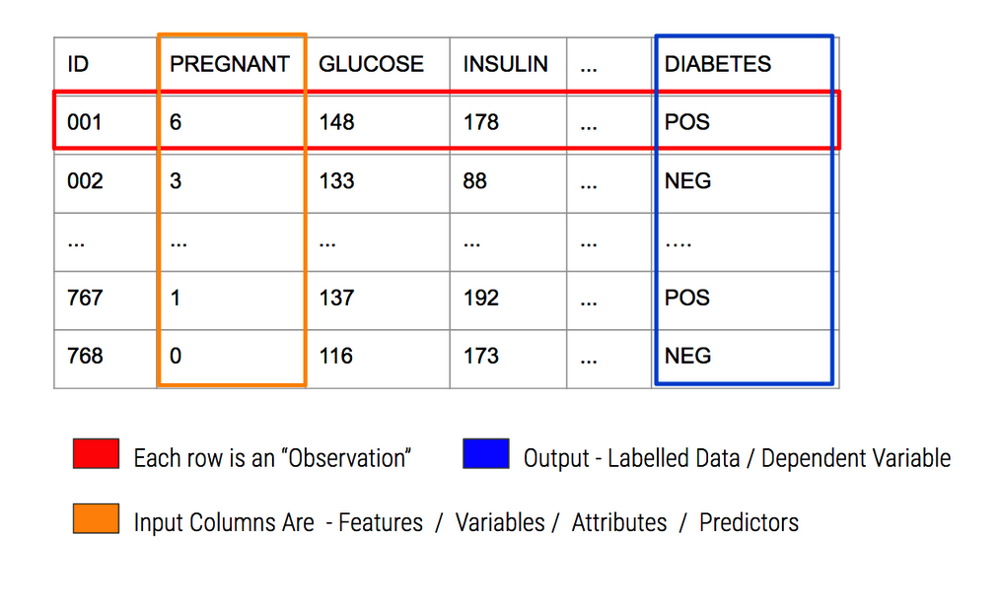
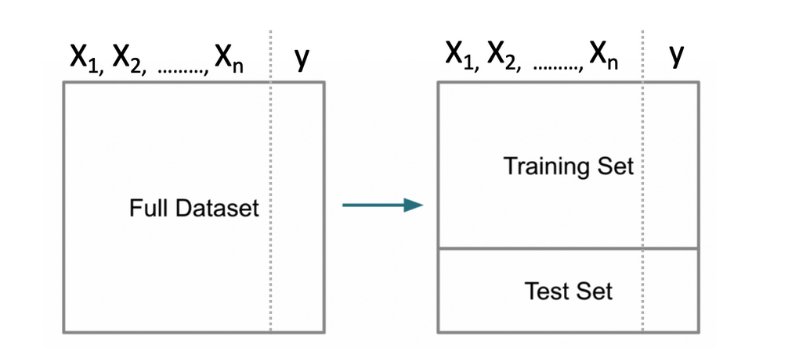
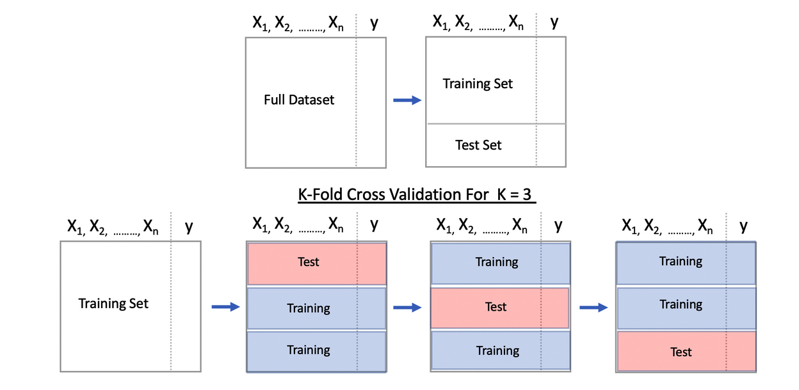

```{r echo=FALSE}
suppressMessages(library(tidymodels))
```

# Introduction

This notebook motivates the use of the tidy models as a way to simplify the processes associated with building models and evaluating them. While it is entirely possible to use Base R methods to organize data and build models thereon, the tidyverse and tidymodels provide a uniform interface for interacting with data and model assembly. 

## Predictive Modeling 

Predictive Modeling is a type of Machine Learning which itself is a sub branch of Artificial Intelligence. The following graphic provides us with some history of these domains. This is helpful if you are trying to orient yourself in the world of analytics and machine learning. Note that AI has been around for quite some time. The Wikipedia definition of AI is:

    The study of “intelligent agents”: any device that perceives its environment and takes actions that maximize its chance of successfully achieving its goals
    
    

Machine Learning relies upon “patterns and inference” to “perform a specific task without using explicit instructions”. It is a form of Applied AI that attempts to automatically learn from experience without being explicitly programmed. Think of Predictive Modeling as a subset of this which falls into two categories:

**Supervised**

Algorithms that build a model on a set of data containing both the inputs and the desired outputs (“labels” or known numeric values). When you want to map input to known output labels. Build a model that, when applied to “new” data, will hopefully predict the correct label.

**Unsupervised**

Algorithms that take a set of data that contains only inputs, and find structure in the data (e.g. clustering of data points).

This lecture is concerned primarily with Predictive Modeling. Some examples of Predictive Modeling include:

    Predict current CD4 cell count of an HIV-positive patient using genome sequences

    Predict Success of Grant Applications

    Use attributes of chemical compounds to predict likelihood of hepatic injury

    How many copies of a new book will sell ?

    Will a customer change Internet Service Providers ?

A typical workflow in support of predictive modeling might look this:


**In-Sample vs Out-Of-Sample Error**

The goal of predictive model is to generate models that can generalize to new data. It would be good if any model we generate could provide a good estimate of out of sample error. It’s easy to generate a model on an entire data set (in sample data) and then turn around and use that data for prediction. But how will it perform on new data ? Haven’t we just over trained our model ?

**Performance Metrics**

For either case (regression vs classification) we need some type of metric or measure to let us know how well a given model will work on new or unseen data - also known as “out of sample” data. for Classification problems we look at things like “sensitivity”, “specificity”, “accuracy”, and “Area Under Curve”.

For Quantitative outcomes, we look at things like Root Mean Square Error (RMSE) or Mean Absolute Error (MAE). Here is the formula for Root Mean Square Error (RMSE). P represents a vector of predictions and O represents a vector of the observed (true) values.


## The Old Way

While 'old" sounds somewhat negative, there is absolutely nothing wrong using an established approach to model data using Base R. This involves applying specific packages to build, for example, a logistic regression model, a decision tree, or a support vector machine. 

The job involves identifying the appropriate package(s) and then dividing the data up in to training and testing pairs after which a function name is called to do the work. 

At a minimum, one must specify 1) the training data set and 2) a formula which indicates what the target and predictor variables will be. Then you look at the result

1) Identify appropriate packages(s) - glm, RandomForest, ranger, svm, etc
2) Chop up the data into a training and test pair (possibly use cross fold validation)
3) Use the right function name and pass arguments - data and prediction formula
4) Examine result using a pre-defined performance diagnostic (e.g. RMSE, Accuracy, Sensitivity, AUC)

### An Example

Let's run through an example using the infamous **Pima Indians** dataset to predict whether a car has an automatic transmission (0) or a manual transmission (1). First, let's chop up the data into a training and test pair. To get the ball rolling with a practical case, let’s consider the Pima Indians Data Frame. Read in a copy.

```{r}
url <- "https://raw.githubusercontent.com/steviep42/bios534_spring_2020/master/data/pima.csv"
pm <- read.csv(url)

head(pm)
```


The description of the data set is as follows:


In predictive modeling we have some important terminology:




```{r}
corrplot::corrplot(cor(pm[,-9]))
```


Look at some differences between the positive vs negative cases:

```{r}
myt <- table(pm$diabetes)
barplot(myt,
        ylim=c(0,600),
        main="Pima Indians - Count of Cases",
        names.arg=names(myt),
        ylab="Case Count",
        xlab="Cases")
grid()
```


```{r}
boxplot(glucose~diabetes,
        data=pm,
        horizontal = TRUE,
        col="aquamarine",
        main="Distribution of Glucose per Group")
grid()
```

So let's plot Glucose vs Mass to see if any interesting hypotheses come to mind (or not):


```{r}
mysplits <- split(pm,pm$diabetes)

plot(pm$mass,pm$glucose,type="n",
     main="Glucose To Mass Relationship",
     xlab="Mass",
     ylab="Glucose",
     sub="Data from Pima Indians Data")
cols <- c("green","red")

for (ii in 1:length(mysplits)) {
   points(mysplits[[ii]]$mass,
          mysplits[[ii]]$glucose,
          col=cols[ii],pch=18)  
}

# Draw a grid
grid()

# Put up a legend
legend("topright",
       legend=names(mysplits),
       pch=18,
       col=cols,title="Group")

```


```{r}
boxplot(mass~diabetes,
        data=pm,
        horizontal = TRUE,
        col="aquamarine",
        main="Distribution of Mass per Group")
grid()
```


## Splitting Data For Model Building

A fundamental approach used in ML is to segment data into a “training” set which is some percentage of the original data - say 80%. The remaining 20% would be assigned to a “test” data set. Then we build a model on our training data set after which we use that model to predict outcomes for the test data set. This looks like the following.

Note that some scenarios will split the data into three data sets: 1) training, 2) validation, and 3) test. This scenario is used when tuning so called hyper parameters for methods that have "tuning" parameters that could influence the resulting model. We’ll stick with the basic “train / test” approach for now.

Splitting the data is not particularly challenging. We can use the built in sample function in R to do this. We aren’t sampling with replacement here which guarantees that no record can exist in both sets. That is, if a record from the data set is assigned to the training set, it will not be in the test data set.





```{r}
set.seed(123)  # Makes this example reproducible
nrows <- nrow(pm)
propo <- 0.70

# Get the first 20 indices 
(idx <- sample(1:nrows,propo*nrows))
```
Now, we create the train/test pair:

```{r}
pm$diabetes <- factor(pm$diabetes)
train <- pm[idx,]
test  <- pm[-idx,]

print(paste("Training data has",nrow(train),"rows"))
print(paste("Testing data has",nrow(test),"rows"))
```

## A First Model

Now let’s build a Generalized Linear Model to do the prediction. We will employ logistic regression.

Decision Trees are an easy way to get started with modeling because they do not require us to scale data or make distinctions between categorical vs continuous quantities. 

Random forests are a generalization of a single Decision Tree that control for the tendency of a single tree being overtrained on the data - and thus unsuitable for application to test data. We will use a package called **randomForest** to build a series of trees on our training data. 

Before processing, we should turn diabetes into a factor so R can understand this when creating a model

```{r}
myglm <- glm(diabetes ~ .,
             data = train,
             family = "binomial")

summary(myglm)
```

Some of the features (e.g. age, insulin, triceps) do not appear to be important or significant though we'll ignore that for now - just like a lot of professional machine learning specialists do everyday (to their own peril). 

We could now use this new model to predict outcomes using the test data set. Remember that we are attempting to predict a binary outcome - in this case whether the person is positive for diabetes or negative. What we get back from the prediction object are probabilities for which we have to determine a threshold above which we would say the observation is “positive” for diabetes and, below the threshold, “negative”.

```{r}
probs <- predict(myglm,
                 newdata = test,
                 type = "response")

probs[1:10]
```

With logistic regression we are dealing with a curve like the one below which is a sigmoid function. The idea is to take our probabilities, which range between 0 and 1, and then pick a threshold over which we would classify that person as being positive for diabetes. In this context, we have a continuum.


```{r}
myseq <- seq(-6,6,.1)
myfunc <- function(x) {1/(1+exp(-x))}
plot(myseq,myfunc(myseq),
     type = "l",
     main = "Standard Logistic Sigmoid Function",
     ylab = "")
abline(h=0.5,lty=2)
abline(v=0,lty=2)
text(-0.5,0.55,"0.5")
grid()
```

### Selecting The Correct Alpha

The temptation is to select 0.5 as the threshold such that if a returned probability exceeds 0.5 then we classify the associated subject as being “positive” for the disease. But then this assumes that the probabilities are distributed accordingly. This is frequently not the case though it doesn’t stop people from using 0.5. Another way to view this is as follows. This graphic shows a “perfect” classifier which more or less matches the logit function above:


Note that this is a rare situation wherein there exists a clean separation between negative and positive cases. We could have something like this:


Or this:


One thing we should do here is to look at the distribution of the returned probabilities before making a decision about where to set the threshold. We can see clearly that selecting 0.5 in this case would not be appropriate.

```{r}
boxplot(probs, 
        main="Probabilities from our GLM Model")
grid()
```

The median appears to be somewhere around .25 so we could use that for now although we are just guessing.

```{r}
mypreds <- ifelse(probs > 0.25,"pos","neg")
mypreds <- factor(mypreds, levels = levels(test[["diabetes"]]))
mypreds[1:10]
```

### Confusion Matrices

Next, we would compare our predictions against the known outcomes which are stored in the test data frame:

```{r}
# How does this compare to the truth ?
table(predicted = mypreds,
      actual = test$diabetes)
```

What we are doing is building a “Confusion Matrix” which can help us determine how effective our model is. From such a matrix table we can compute a number of “performance measures”, such as accuracy, precision, sensitivity, specificity and others, to help assess the quality of the model. In predictive modeling we are always interested in how well any given model will perform on “new” data.

There are some functions that can help us compute a confusion matrix. Because the variable we are trying to predict, (diabetes), is a two level factor, (“neg” or “pos”) we’ll need to turn our predictions into a comparable factor. Right now, it’s just a character string.

```{r}
caret::confusionMatrix(mypreds,test$diabetes)
```
### Performance Measures Revisited

This is helpful stuff although there are a number of measures to select as a primary performance metric. Ideally, we would already know which performance metric we would select to effectively “judge” the quality of our model. 

In medical tests, “sensitivity” and “specificity” are commonly used. Some applications use “Accuracy” (which isn’t good when there is large group imbalance).

The problem here is that all we have done is looked at the confusion matrix corresponding to one specific (and arbitrary) threshold value when what we need is to look at a number of confusion matrices corresponding to many different thresholds. 

For example, we might get a better sensitivity level had we selected the mean of the returned probabilities. This process could go on and on and on.

### The ROC Curve

One way to do this is to use something known as the ROC curve. Luckily, R has functions to do this. This isn’t surprising as it is a standard tool that has been in use for decades long before the hype of AI and ML was around. The ROC curve gives us a “one stop shop” for estimating a value of alpha that results in maximal area under a curve.

In fact, maximizing the area under a given ROC curve winds up being an effective way to judge the differences between one method and another. So, if we wanted to compare the glm model against a Random Forest model, we could use the respective AUC (Area Under Curve) metric to help us. This isn’t the only way to do this but it’s reasonable for now.

```{r}
pred <- ROCR::prediction(predictions = probs,
                         labels = test$diabetes)

perf <- performance(pred,
                    "tpr",
                    "fpr")

myroc <- performance(pred,measure="auc")

plot(perf,colorize=T,
        print.cutoffs.at=seq(0,1,by=0.1),
     lwd=3,las=1,main=paste("Cool Ranger ROC Curve with",round(myroc@y.values[[1]],3),"AUC"))
abline(a = 0, b = 1)

grid()
```

So what value of alpha corresponds to the statedAUC of .85 ? We’ll have to dig into the performance object to get that but it looks to be between 0.30 and 0.40. Note that this is somewhat academic since knowing the max AUC alone helps us decide if our model is any “good”. For completeness we could use another R function to nail this down:

```{r}
proc <- pROC::roc(test$diabetes,probs)
round(pROC::coords(proc, "b", ret="t", transpose = FALSE),2)
```
Generally speaking, here is a graphic which shows you some ROC curve shapes and how they relate to AUC.


We haven’t accomplished very much here because we need to look at multiple versions of the data in case we sampled a number of outliers in the creation of our training data. Or, maybe we have excluded a large number of outliers in the training set so they wound up in the test data set which means that the predictive power of our model isn’t as robust as it should be.

Our next steps should involve creating multiple versions of the training and test pairs (say 3 times), compute the optimal AUC, and then look at how those values vary for each of those individual versions. If the AUCs vary widely then maybe our model is over training. If it’s not varying widely, it could be that that the model has high bias.

## Cross Fold Validation

What if, when splitting the data into a training and testing pair, the test set wound up containing most of the outliers in the data (assuming there were any). This means that our trained model would probably under perform on the test data since the model did not "see" most of the outliers. 

Or, consider the situation wherein the training data had most of the outliers and the resulting model was influenced by this. So, when applied to the testing data, the predictive results are not that great. 

A way to combat this is to split the data into K number of groups aka "folds" - say 3. Then set up a loop that uses K-1 folds to train a model while using the "hold out" fold as the test data set. This means that each fold is used as a test set once.

It also means that each fold also gets used as part of a trained model thus we can offset the impact of any outliers found in the data set. Note, we are not trying to perfectly model the data, we just want to get a realistic idea as to how it might perform on unseen data. 

The method works by giving us multiple estimates of out-of-sample error, rather than a single estimate. Let's assume K is equal to 3 so we will partition our data into 3 individual “folds”" which are basically equal in size. Then we’ll create a loop that does the following:

    Combines 2 of the folds into a training data set
    Builds a model on the combined 2-folds data
    Applies the model to holdout fold
    Computes the AUC value and stores it

Each fold is simply a portion of the data. We’ll generate a list called “folds” that contains 3 elements each of which are 256 index elements corresponding to rows in pm. The way we did the sample insures that each row shows up only in one fold.

{width=120%}

We could write our own function to not only create some number of folds but to also build a model, make predictions and store the accuracy for a given set of folds. Remember, each fold gets to be a "test" data set as part of the process.

```{r}
cross_fold <- function(numofolds = 4,df=pm) {
  
  # Function to Do Cross fold validation
  
  # Split the data into K folds (numofolds)
  
  folds <- split(sample(1:nrow(df)),1:numofolds) 
  
  # We setup some blank lists to stash results
  folddf    <- list()  # Contains folds
  modl      <- list()  # Hold each of the K models
  predl     <- list()  # Hold rach of the K predictions
  auc       <- list()  # Hold the auc for a given model
  
  # Create a formula that can be used across multiple
  # iterations through the loop. 
  
  myform <- "diabetes ~ ."
  
  for (ii in 1:length(folds)) {
    
    # This list holds the actual model we create for each of the 
    # 10 folds
    
    modl[[ii]] <- glm(formula = myform, 
                      data = df[-folds[[ii]],],
                      family = "binomial")

    
    # This list will contain / hold the models build on the fold
    
    predl[[ii]]  <- predict(modl[[ii]],
                            newdata=df[folds[[ii]],],
                            type="response")
   
    # This list will hold the results of the AUC per iteration
    
    pred <- ROCR::prediction(predl[[ii]],
                             df[folds[[ii]],]$diabetes)
    
    roc  <- performance(pred,measure="auc")
    auc[[ii]] <- roc@y.values[[1]]
  }
  return(unlist(auc))
}
```

Running this is now quite simple. By default, this function will loop some number of times corresponding to the number of folds. During each iteration it will:

    use glm to build a model on the training folds
    create a prediction object using the training fold
    compute the underlying AUC associated with the prediction
    store the AUC in a vector

At the end of the function, the vector containing the computed AUCs will be returned.

An advantage of this approach is that we can now look at a range of accuracy values (K of them) instead of just one. This gives us a better idea about how the model might perform on future data. Here we will look at accuracy across 8 folds:


```{r}
numofolds <- 8
boxplot(cross_fold(numofolds = numofolds),
        main=paste("Distribution of Accuracy for",numofolds,"folds"),
        horizontal = TRUE)
grid()
```

```{r}
lattice::stripplot(cross_fold(8),
          main="AUC values for K-Fold Validation",
          type=c("g","p"),pch=19,cex=1.5)
```


We can even replicate this to approximate something known as repeated cross validation:

```{r}
numofolds <- 8
numofrepl <- 20

main <- paste("Accuracy Across",numofolds,"folds","\n and",numofrepl,"replications")
reps <- replicate(numofrepl,cross_fold())

boxplot(reps,
        main=main,cex.axis=.8,
        xlab="Simulation Number",
        ylim=c(min(reps)-0.025,max(reps)+0.025),
        ylab="Accuracy")
grid()
```


### Decision Trees

Decision Trees are an easy way to get started with modeling because they do not require us to scale data or make distinctions between categorical vs continuous quantities. 

Random forests are a generalization of a single Decision Tree that control for the tendency of a single tree being overtrained on the data - and thus unsuitable for application to test data. We will use a package called **randomForest** to build a series of trees on our training data. 

Before processing, we should turn diabetes into a factor so R can understand this when creating a model


```{r}
suppressMessages(library(randomForest))
(rf_mod <- randomForest(diabetes ~ .,train,
                        importance=TRUE,
                        ntree=100))
```
Now, when we build a model we need to determine some type of performance metric by which to judge the quality of the model particularly as it relates to unseen data. 

Accuracy is one of the most basic measures though it has a number of weaknesses though we aren't here to get into that. We use it here because it is easy to calculate - the number of times out model predictions actually matched the known outcomes divided by the total number of observations in the training data set. 

We can use the R **predict** function to make predictions using our model. In this case we'll use the very data we used to create the model as input into the prediction. 


```{r}
# 
(rf_mod_train_preds <- predict(rf_mod,train[,-9]))[1:20]
```

Lets make a table of this information to see how accurate this model is. 

```{r}
(confusion <- table(actual=train$diabetes,predicted=rf_mod_train_preds))
my_accuracy <- sum(diag(confusion))/sum(confusion)
print(paste("The accuracy of the training model is:",round(accuracy,2)))
```
Not surprisingly, this model is quite accurate when applied to the very data that was used to create it. This is where many novice model builders start to celebrate but it's not particularly useful when anticipating model performance on unseen / test data. Let's apply the model to the test data


```{r}
(rf_mod_test_preds <- predict(rf_mod,test[,-9]))
```
Let's now compute the accuracy on the test data in the same we did previously for the training data. 

```{r}
(confusion <- table(actual=test$diabetes,predicted=rf_mod_test_preds))
accuracy <- sum(diag(confusion))/sum(confusion)
print(paste("The accuracy of the testing model is:",round(accuracy,2)))
```

There are packages which can help us compute the confusion matrix as well as associated performance measures of interest. 

```{r}
caret::confusionMatrix(confusion,positive="pos")
```

## Another Model?

We could use another package to generate the tree if we thought that might be useful. This happens a lot in modeling wherein someone comes out with a brand new cool package that promises to blow away the competition in performance and accuracy. Once you get such a package installed you could then use the same training and testing data as above to see if it did anything interesting or maybe performed much better.

In this case, let's use the **ranger** package which also builds random forests. One thing you will need to do is understand the arguments to this specific function. While both **ranger** and **randomForest** build trees, the arguments can be different. There is no uniform interface to all functions that might build trees. Also, consider that if we wanted to use another method, like Support Vector Machines, the calling arguments would be much different. We'll discuss this more later. 

```{r}
library(ranger)
(ranger_mod <- ranger(diabetes ~ .,train,
                      num.trees=100,
                      write.forest=TRUE))
```

Next up is where we make the predictions using the test data and then check the accuracy. Note here that the return **ranger** object contains predictions which is different than how the **randomForest** function behaved. So, again we have to keep track of how the indiviudal functions work. 

```{r}
ranger_mod_test_preds <- predict(ranger_mod,data=test[,-9])$predictions
(confusion <- table(actual=test$diabetes,predicted=ranger_mod_test_preds))
caret::confusionMatrix(confusion,positive="pos")
```
## AUC

So a popular way to determine the overall performance of a model is to look at the so called ROC curve which is a generalization of probabilities used to determine when a a given observation is positive or negative for diabetes. In trees we don't exactly have probabilities but decisions as to whether given values are above or below some threshold although we could dig into the tree object to get something comparable. 

Suffice it to say that the ROC curve can be integrated and we hope that the area underneat it is as close to 1 as we can get although that is something of an ideal that is seldom achieved.The axes are the sensitivity and 1 - specificity. A more detailed explanation of the ROC curve is outside the scope of this lecture but we can dig into that later. For now, let's just figure out how to make one. 

```{r}
(ranger_mod <- ranger(diabetes ~ .,train,
                      num.trees=100,
                      write.forest=TRUE,
                      classification = TRUE,
                      probability = TRUE))

ranger_pred <- predict(ranger_mod,data=test)


pred <- ROCR::prediction(ranger_pred$predictions[,2],
                         test$diabetes)

perf <- performance(pred,
                    "tpr",
                    "fpr")

myroc <- performance(pred,measure="auc")

plot(perf,colorize=T,
        print.cutoffs.at=seq(0,1,by=0.1),
     lwd=3,las=1,main=paste("Cool Ranger ROC Curve with",round(myroc@y.values[[1]],3),"AUC"))
abline(a = 0, b = 1)

grid()

```

How does this compare to the AUC generated by the randomForest function?

```{r}
(rf_mod <- randomForest(diabetes ~ .,train,
                      ntree=100,
                      keep.forest=TRUE))

rf_pred <- as.data.frame(predict(rf_mod, test, type = "prob"))


pred <- ROCR::prediction(rf_pred[,2],
                         test$diabetes)

perf <- performance(pred,
                    "tpr",
                    "fpr")

myroc <- performance(pred,measure="auc")

plot(perf,colorize=T,
        print.cutoffs.at=seq(0,1,by=0.1),
     lwd=3,las=1,main=paste("Cool RF ROC Curve with",round(myroc@y.values[[1]],3),"AUC"))
abline(a = 0, b = 1)

grid()
```


## Summary 

So we have to create our own test and training pair as well as understand the specific arguments to whatever function we wish to use. Then we try to find a way to compare the output of the predictions with the known reality found in the test data set. If we picked yet another approach, say logistic regression, then we might have to scale the data while being careful to choose correct argument values appropriae to the method. What we really need is a uniform approach to this. 

## A Different Approach

The **tidyverse** represents an extension on top of the functions found in the default installation of R. Using **tidy** commands is entirely optional and there is no need to use them except in pursuit of the concepts the tidyverse seeks to implement.

That sounds like circular logic but the idea is to use an approach that generalizes across multiple steps in data manipulation and modeling. Being able to easily reuse R objects (data, results, figures) is a big deal because it simplifies the construction and comparison of models which in turn facilitates reproducibility.

One would also like to be able to transfer knowledge acquired in using one package to other packages in the R environment. That said, in my view (and it's only that), having a good knowledge of base R is important since you are likely to encounter "legacy" code which does not use things like the **tidyverse** or **tidymodels**.

Some introductory courses dive straight into the **tidyverse** and that is fine to an extent. It's just that if you enter a work environment that has lots of older R code you will need to work to understand it. As this presentation assumes previous experience with R we will not be going over R basics.

## The tidyverse

The **tidymodels** package comprises a number of supporting packages and installing it is as simple as doing:

```{r install,eval=FALSE}
install.packages("tidymodels")
```

The **tidymodels** package relies on the **tidyverse** package which provides verbs that correspond to common data manipulation activities. The **tidyverse** package also provides the **ggplot2** package which is a premier visualization tool. Back to the verbs. Here are some basic examples using the **mtcars** data frame which is frequently used in R education due its simplicity and small size.

Let's filter the data based on values assumed by one or more columns.

```{r select1}
filter(pm, pregnant > 10 & age < 40)
```

```{r}
# Get all rows where diabetes is "pos" and mass is < 20
filter(pm, diabetes == "pos" & mass < 20)
```

We can even do aggregation using tidyverse functions. What is the average glucose per diabetes group?

```{r}
summarize(group_by(pm,diabetes),avg=mean(glucose))
```

### Piping 

One of the coolest functions provided by tidyverse is the pipe operator which allows us to feed the output of one command to the input of another in a left-to-right fashion. This concept is now new and was originally developed for use in the UNIX / LINUX operating system.

```{r}
# The pipe operator is %>%
pm  %>% filter(diabetes == "pos" & mass < 20)
```

We can conveniently sort data. In this case we filter out cars with MPG greater than 15 and a weight less than 2 tons and then arrange the result in order of highest MPG to lowest.

```{r}
pm %>% filter(diabetes == "pos" & mass < 25) %>% arrange(desc(glucose))
```

As applied to our above grouping example we could de-couple the somewhat verbose Base R command line:

```{r}
pm %>% group_by(diabetes) %>% summarize(average_glucose=mean(glucose))
```

Note that the "%>%" operator allows us to **route** the output of a command to the input of another command. Here is a more simple example:

```{r}
pm %>% filter(mass > 50)
# same as
filter(pm, mass > 50)
```

Back to our aggregation pipeline, we can "pipe" the result into the ggplot function to get a visualization. ggplot requires us to provide it tables or data frames. Actually it prefers "tibbles" which is a type of data frame but that's getting off track a little bit.

```{r}
pm %>% 
  group_by(diabetes) %>% 
  summarize(average_glucose=mean(glucose)) %>%
  ggplot(aes(x=diabetes,y=average_glucose)) + 
    geom_bar(stat="identity")  + 
    ggtitle("Avg Glucose / Group")
```

If we wanted to improve upon this we could, perhaps by making the transmission type into a factor with more intuitive labels. Here we will introduce another **tidyverse** function to **mutate** the **am** variable into a factor.

```{r}
pm %>% 
  group_by(diabetes) %>% 
  summarize(average_glucose=mean(glucose)) %>%
  ggplot(aes(x=diabetes,y=average_glucose)) + 
    geom_bar(stat="identity")  + 
    theme_light() + 
    labs(title = "Average Glucose / Group", 
         subtitle = "Data extracted from Pima Indians Data set", 
         caption = "Super Cool tidyverse example")
```

A distinct advantage of this approach is that we did not change in anyway the original data frame. Check it out:

```{r}
head(pm)
```

The piping allows for free-form experimentation without the need for having to save temporary and/pr incremental versions of data frames which is frequently the case when using Base R commands. Here is another example:

```{r}
pm %>%
  ggplot(aes(x=mass,y=glucose,color=diabetes)) + 
  geom_point() +
  labs(
    title = "Glucose Level vs Mass",
    caption = "Data from the Pima Indians Data set.",
    tag = "Figure 1",
    x = "Mass in kg(height in m)^2",
    y = "Plasma glucose concentration",
    colour = "diabetes"
  ) + theme_bw()
```

## Tidymodels

Let's experiment with the tidymodels package to learn how to leverage its considerable strengths when building, evaluating, and comparing models.

The **tidymodels** package can be useful even if you are just experimenting since it provides a standard and uniform approach by which to work. In Base R, each modelling function, lm, glm, rpart, svm, will all have arguments specific to the respective command, which contributes to confusion when switching between models for purposes of comparison. This is where **tidymodels** can be very helpful.

In the interest of promoting immediate use, let's create a random forest to predict whether a subject from the Pima Indians data frame is postive or negative for diabetes.


## Tidy models

One of the benefits of the **tidymodels** package is that it provides front ends for the many methods available in R which includes Decision trees and extensions there upon. We might also want to indicate that the transmission column is a factor.

There are a number of ways to do that. In this case, we have to reasonably interpret the "event" since we are predicting. In our situation a car is either manual (1) or (0) automatic so if we create a factor use thing following

```{r}
url <- "https://raw.githubusercontent.com/steviep42/bios534_spring_2020/master/data/pima.csv"
pm <- read.csv(url)

pm <- pm %>% mutate(diabetes=factor(diabetes))
skim(pm)
```

The way tidyverse will interpret this as 0 (automatic) being the "event". Sort of like being positive for a disease. We could change this if we wanted a "1" to be the "event".

## A First Model

Let's use the **ranger** package to create a random forest. Except this time we will use the tidy approach.  Note that the **ranger** package must also be installed for this example to work. 

It is important to understand that the **tidymodels** package does not attempt to replace or rewrite common and popular R packages for model assembly. It merely "sits on top" of them while providing a standard and uniform interface across many of them.

The advantage to you as the user is that you do not necessarily need to know all of the individual arguments to a specific command in order to use it though if you do then you can still leverage that information.

```{r}
# Let's declare out interest in creating a random forest after which we 
# pipe the result into the set_engine function to get more specific with what 
# underlying function we want.

pm_ranger <- rand_forest(trees = 100, mode = "classification") %>%
  set_engine("ranger") %>%
  fit(diabetes ~ ., data = train)
```

Note that above - we don't invoke the model using one monolithic command. We split the activity across three commands all of which are methods that can used with other modeling methods. In this case we are selecting a specific random forest **engine** using **ranger** to do the work. If necessary we could pass in arguemnts which are specific to a given method although that isn't necessarily required. For now, let's check out the default results 

```{r}
pm_ranger
```

So we have the results in the form of an object, in this case a **parsnip** object which has various pieces of information that we can use to determine the basic characteristics of the model. We haven't yet done anything with the model, we've just generated it. To illustrate how tidymodels commands will generalize, here is another example where we build the random forest using the **randomForest** package as an alternative to **ranger.** The interface language is the same except for the "engine" argument.

```{r}
pm_rf <- rand_forest(trees = 100, mode = "classification") %>%
  set_engine("randomForest") %>%
  fit(diabetes ~ ., data = train)
```

Check the output

```{r}
pm_rf
```

## Predictions

In terms of making a prediction, we can do that easily. The **predict** function is what we call a generic function in R which understands how to do its work based on the type of object and data that it is being given. Remember that we built a model which returned an object. We can pass that to the **predict** function:

```{r}
# Use the ranger model to make a prediction
test_preds <- predict(pm_ranger,test)
test_preds[1:10,]
```

So we get back some predictions as to whether a subject is positive or negative for diabetes which we could then compare to the actual values. This would allow us to create a confusion matrix that would then permit the computation of various performance measures such as accuracy, sensitivity, specificity, etc.

In the tidymodels world, there are functions that will give this information to us without the need for the confusion matrix unless we want it. 

The following shows us the predictions as part of the data frame. The tidyverse very much likes for things to be in a data frame format - actually something called a **tibble** which is a data frame optimized for use with the tidyvserse:s


```{r}
pm_ranger %>%
  predict(test) %>%
  bind_cols(test) %>%
  glimpse()
```

This sets the stage for evaluating the accuracy of the predictions resulting from the model:

```{r}
pm_ranger %>%
  predict(test) %>%
  bind_cols(test) %>%
  metrics(truth=diabetes, estimate=.pred_class)
```
Our accuracy in this case is 0.8. What is the specificity of this model?

```{r}
pm_ranger %>%
  predict(test) %>%
  bind_cols(test) %>%
  spec(truth=diabetes, estimate=.pred_class,event_level="second")
```

What about the sensitivity? 

```{r}
pm_ranger %>%
  predict(test) %>%
  bind_cols(test) %>%
  sensitivity(truth=diabetes, estimate=.pred_class,event_level="second")
```

So we could derive all the metrics directly from the confusion matrix.

```{r}
pm_ranger %>%
  predict(test) %>%
  bind_cols(test) %>%
  conf_mat(truth=diabetes, estimate=.pred_class)
  
```

Or, we could pipe the resulting table into the **confusionMatrix** function from the caret package. This is somewhat ironic in that the primary author for the caret package is Max Kuhn who is also a primary author of the tidymodels package. 

```{r}
pm_ranger %>%
  predict(test) %>%
  bind_cols(test) %>%
  conf_mat(truth=diabetes, estimate=.pred_class) %>%
  pluck("table") %>%
  caret::confusionMatrix(pos="pos")
```

But we don't need to do this as tidymodels has its own way of getting multiple metrics all at once:

```{r}
# Note that sensitivity is also known as recall
my_metrics <- metric_set(accuracy, sens, spec, precision, recall)
pm_ranger %>%
  predict(test) %>%
  bind_cols(test) %>%
  my_metrics(truth=diabetes, estimate=.pred_class, event_level = "second") 
  
```


And what about drawing ROC curves? The tidymodels has that covered also. 

```{r}
pm_ranger %>%
  predict(test,type="prob") %>%
  bind_cols(test) %>%
  roc_curve(truth=diabetes,estimate=.pred_pos,event_level="second") %>%
  autoplot()
```
We can improve upon the default plot:

```{r}
# Get the AUC
pm_range_roc_auc <- pm_ranger %>%
  predict(test,type="prob") %>%
  bind_cols(test) %>%
  roc_auc(truth=diabetes,estimate=.pred_pos,event_level="second")

# Put up an annotated plot
pm_ranger %>%
  predict(test,type="prob") %>%
  bind_cols(test) %>%
  roc_curve(truth=diabetes,estimate=.pred_pos,event_level="second") %>%
  ggplot(aes(x=1 - specificity, y = sensitivity)) + 
  geom_path() + 
  geom_abline(lty=3) +
  coord_equal() + 
  labs(title=paste("ROC Curve for Ranger with",round(pm_range_roc_auc$.estimate,3),"AUC")) +
  theme_bw()


```


## Data Management

So another nice thing about the tidymodels realm is that it provides a way to create and manage the training and test pair. 

# Partitioning The Data

```{r}
set.seed(123)
pm_split <- initial_split(pm,prop=0.7)
pm_split
```

This gives us a self-contained object with all the information necessary to get the training and test data on demand. The following will get the training data

```{r}
training(pm_split)
```

The following will get the test data

```{r}
testing(pm_split)
```

Let's repeat our random forest model on the new training data. 

```{r}
pm_training <- training(pm_split)
pm_rf <- rand_forest(trees = 100, mode = "classification") %>%
  set_engine("randomForest") %>%
  fit(diabetes ~ ., data = pm_training)
```

Now let's do some predictions using the test data

```{r}
pm_testing <- testing(pm_split)
pm_rf %>%
  predict(pm_testing) %>%
  bind_cols(pm_testing) %>%
  accuracy(truth = diabetes, estimate = .pred_class)
```

```{r}
pm_rf %>%
  predict(pm_testing) %>%
  bind_cols(pm_testing) %>%
  sens(truth = diabetes, estimate = .pred_class,event_level="second")
```


## Cooking Up A Model

So this is fine in that we can leverage the tidy way of doing things as we build a model. We can also benefit from a uniform interface to the underlying functions that we might use which us helpful. 

Also consider the scenario of wanting to pre-process the data in some way such as scaling predictor variables? This approach involves understanding some basic metaphors which is easy once you realize that it all relates to cooking food. Let's make a "recipe" to prep our data for use with logistic regression.


```{r}
pm_recipe <- training(pm_split) %>%
  recipe(diabetes ~.) %>%
  step_center(all_numeric(), -all_outcomes()) %>%
  step_scale(all_numeric(), -all_outcomes()) %>%
  prep()

(pm_recipe)
```

The recipe itself is just that - a document of intention for something to be prepped or "baked" into usable data. To actually "cook" the recipe which has been prepped, we use the **bake** function in combination with the data of interest. 

```{r}
pm_training <- pm_recipe %>%
  bake(training(pm_split)) 

glimpse(pm_training)
```

Similarly, if we want the testing data to have the same pre-processing we need to bake the recipe against it. 

```{r}
pm_testing <- pm_recipe %>%
  bake(testing(pm_split)) 
```

See how the data has been scaled - everything that is except the target variable. We could go ahead then and train the model on the baked data which we have now stored in the mtcars_training object. 

```{r}
pm_svmrbf <- svm_rbf(mode = "classification") %>%
  set_engine("kernlab") %>%
  fit(diabetes ~ ., data = pm_training)

predict(pm_svmrbf,pm_testing) %>%
  bind_cols(pm_testing) %>%
  spec(truth=diabetes, estimate=.pred_class,event_level="second")
```
We can consolidate the creation of the model along with the recipe used to pre-process data into a **workflow**. To review, here is our recipe minus the prep and a formula definition.


```{r}
pm_recipe <- training(pm_split) %>%
  recipe(diabetes ~ .) %>%
  step_center(all_numeric(), -all_outcomes()) %>%
  step_scale(all_numeric(), -all_outcomes())
```

Here is the model definition minus the fit:

```{r}
pm_rf <- rand_forest(trees = 100, mode = "classification") %>%
  set_engine("randomForest") 
```

Combine these into a workflow:

```{r}
pm_workflow <- workflow() %>%
  add_model(pm_rf) %>%
  add_recipe(pm_recipe)
```

Then we fit the workflow which brings it all together

```{r}
pm_workflow_fit <- fit(pm_workflow,data=training(pm_split))
```


Make predictions:

```{r}
predict(pm_workflow_fit,testing(pm_split)) %>%
  bind_cols(testing(pm_split)) %>%
  conf_mat(truth=diabetes, estimate=.pred_class)
  
```

Define a new model

```{r}
mtcars_svmrbf <- svm_rbf(
  mode = "classification",
  engine = "kernlab")
```

Now see how easy it is to swap the model in the previously defined workflow:

```{r}
remove_model(pm_workflow)
update_model(pm_workflow,mtcars_svmrbf)
mtcars_workflow_fit <- fit(pm_workflow,data=training(pm_split))

#

predict(pm_workflow_fit,testing(pm_split)) %>%
  bind_cols(testing(pm_split)) %>%
  conf_mat(truth=diabetes, estimate=.pred_class)
```

```{r}
hold <- rfcv(train[-9],train[,9],cv.fold=10)
```


```{r}
mtcars %>% 
  as_huxtable() %>% 
  set_all_borders(1) 
```
```{r}
multi_metric <- metric_set(yardstick::accuracy, sens, spec)
predict(pm_workflow_fit,testing(pm_split)) %>%
  bind_cols(testing(pm_split)) %>%
  multi_metric(truth=diabetes, estimate=.pred_class,event_level="second")
```


